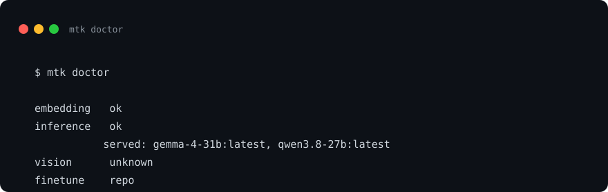
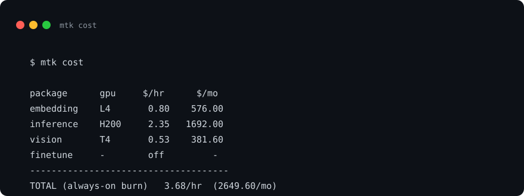
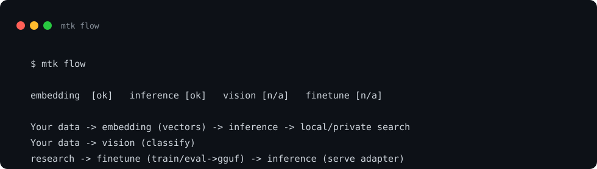
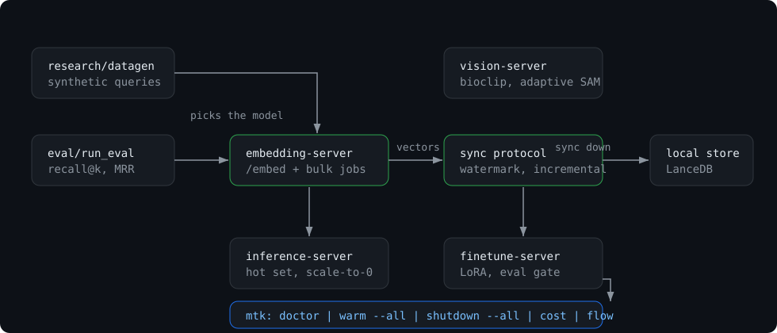

# Modal Toolkit

One operator CLI for the **Modal Toolkit**: standalone GPU/research packages that work alone or together: embeddings, LLM inference, vision, LoRA fine-tune, and the hosted vault + MCP memory plane, plus the eval harness that starts the lifecycle.

[](LICENSE)
[](https://www.python.org/)
[](https://github.com/sponsors/kylebrodeur)

## The packages

This CLI orchestrates the packages; each is its own standalone repo and can be used without the toolkit:

- **[modal-embedding-server](https://github.com/kylebrodeur/modal-embedding-server):** GPU-backed embeddings with a monotonic sync protocol for private-first search.
- **[modal-inference-server](https://github.com/kylebrodeur/modal-inference-server):** OpenAI-compatible LLM inference with hot-set routing and scale-to-zero.
- **[modal-vision-server](https://github.com/kylebrodeur/modal-vision-server):** Generic vision classification: pick your model (open_clip or transformers weights), your segmenter (SAM 2.1 or none), and your fast gate (self, cheap CLIP, deterministic script, or external endpoint). The BioCLIP plant stack ships as the example card.
- **[modal-vault-server](https://github.com/kylebrodeur/modal-vault-server):** Hosted Obsidian vault + MCP memory plane: server-side clone via Headless Sync, searchable by MCP-speaking agents.
- **[modal-finetune-server](https://github.com/kylebrodeur/modal-finetune-server):** Profile-driven LoRA fine-tune and GGUF pipeline with an honest eval gate.
- **[modal-toolkit](https://github.com/kylebrodeur/modal-toolkit):** One operator CLI (`mtk`) that runs the fleet: `doctor`, `warm --all`, `shutdown --all`, `cost`, `flow`.
- **[embed-eval-on-your-vault](https://github.com/kylebrodeur/embed-eval-on-your-vault):** the eval-first pattern (benchmark embedding models on your own data before you deploy) as a single-file, zero-dependency harness.

## What `mtk` adds

A single entry point for **fleet-level verbs** that don't belong in any one package:

| Command | Purpose |
| :--- | :--- |
| `mtk setup` | Write the shared config (`~/.config/modal-toolkit/config.json`, mode 600) |
| `mtk config` | Inspect + validate the shared config |
| `mtk doctor [--pkg ... --json]` | Health + drift across all four packages in one shot |
| `mtk warm [--pkg ... --all]` | Cold-start a package's GPU worker |
| `mtk shutdown [--pkg ... --all]` | Scale GPU(s) to zero now |
| `mtk cost` | Per-package + blended always-on GPU-hour view |
| `mtk flow` | The ecosystem flowchart, rendered against live state |
| `mtk dashboard deploy \| stop \| logs \| url` | The fleet dashboard: one CPU app with a card per package |
| `mtk secrets` | Fleet-level Modal Secrets: `check` (drift diff), `create`, `rotate` |
| `mtk metrics` | Push app events/rates to VictoriaMetrics (or InfluxDB) from any package or Modal app; stdlib-only writer + test verb |

Per-package deep work (thin wrappers that shell into each sibling repo):

```
mtk embedding sync | reindex
mtk vision deploy | warm
mtk finetune train | eval | gguf
```

## The fleet dashboard

One CPU-only Modal app (`mtk dashboard deploy`) that shows every package
as a card: unauthenticated `/health` for the state pill, one
authenticated read for the headline (embedding: collections + loaded
models; inference: served aliases; vision: model + segmenter; finetune:
job-package card). Session auth is its own bearer credential
(`MODAL_TOOLKIT_DASHBOARD_TOKEN`, hash-fragment autologin supported).
Billing is fleet-wide: metered month/today, workspace billed vs
credits, per-app split, and a workspace-disabled banner.

```bash
modal secret create modal-toolkit-dashboard-secret MODAL_TOOLKIT_DASHBOARD_TOKEN=$(openssl rand -hex 32)
mtk dashboard deploy   # seeds the config Volume from your mtk config
# open the printed URL ... or visit /_toolkit/login#key=<credential>
mtk dashboard stop     # scale to zero
```

Deploying and keying the dashboard is per-operator: create your own
secret, deploy under your own workspace. Nothing in the packages
depends on this app existing.

The dashboard is read-only across packages (single-writer per package)
and links to each package's own deep surface (the inference dashboard
keeps runtime tuning, catalog, and slot telemetry).

## The fleet at a glance





## The lifecycle



## Quick Start

```bash
uv sync --group dev

# 1. Set up the shared config (per-package URL/token/defaults)
mtk setup --repos-root /path/to/your/repos-dir
# (or import an existing config: mtk setup --from-env)

# 2. Inspect
mtk config

# 3. Health across the fleet
mtk doctor
```

## Configuration

One file, four per-package sections. Tokens are never printed by any `mtk` verb.

```
~/.config/modal-toolkit/config.json
{
  "embedding":  {"base_url": "...", "token": "...", "model": "...", "dim": 768},
  "inference":  {"base_url": "...", "token": "...", "alias": "...", "dashboard_url": "...", "dashboard_token": "..."},
  "vision":     {"base_url": "...", "token": "...", "model": "...", "gpu": "T4"},
  "finetune":   {"base_model": "...", "adapter_repo": "...", "hf_user": "..."},
  "repos":      {"root": "/path/to/your/repos-dir"}
}
```

Override anything via env (no config edit required):

- `MODAL_TOOLKIT_CONFIG`: use a different config file path
- `MODAL_TOOLKIT_REPOS`: where the four sibling repos live
- `MODAL_BASE_URL`, `MODAL_PROXY_TOKEN`: the standard per-package overrides
- `MODAL_VISION_GPU`, `MODAL_VISION_MODEL`, `FINETUNE_BASE`, `FINETUNE_ADAPTER`, etc.

## Cost model

Modal bills per GPU-hour, never per token. `mtk cost` reports always-on burn per package and the fleet total, using published Modal GPU rates:

```
H200: $2.35/hr    B200: $3.53/hr    H100: $2.10/hr
L40S: $1.10/hr    A10G: $0.60/hr    L4:   $0.80/hr    T4: $0.53/hr
```

The **actual cost** depends on how long containers stay warm; the toolkit's job is to make that visible in one call (and `mtk shutdown --all` the escape hatch).

## Examples

See [`examples/`](examples/) for the full lifecycle: setup → doctor → warm → use → shutdown.

## Operator deploy overlays (`deploys/`)

Upstream repos are **SOURCE, never deploy targets.** Each operator deploys a
private instance from a deploy directory that references the upstream
checkout by path:

```
<operator-repo>/deploys/<pkg>/
├── deploy.json   # instance name (env), knob values, secret NAMES
└── deploy.sh     # exports the env, runs the upstream repo's deploy command
```

- **The rule that matters:** upstream repos are never modified by deploys;
  operator state lives in the overlay, not in the source repo.
- **Secret-name invariant:** `deploy.json`'s secret NAMES must match the
  repo's `server/secrets.toml` manifest — the manifest is the source of
  truth `mtk secrets` acts against, so overlays never invent names.
- **No `mtk deploy` wrapper (by design):** the package's own CLI + the
  operator overlay beat a generic dispatcher.
- Reference implementation: `writing-duo/deploys/embedding-server/`
  (private instance of modal-embedding-server, deployed + verified).

## Contributing

See [CONTRIBUTING.md](CONTRIBUTING.md) for ground rules and workflow.

## Part of the Modal Toolkit

Six repos in the same family: the packages this CLI orchestrates (links in "The packages" above), plus the family's other members listed there too.

## Built on Modal

These packages run on [Modal](https://modal.com), the serverless GPU platform. If you build something with them, share it in the [Modal Slack](https://modal.com/slack) community (`#show-and-tell`). Issues and PRs welcome here on GitHub.

## License

Apache-2.0: see [LICENSE](LICENSE).

---

Built by [Kyle Brodeur](https://kylebrodeur.com) · Model-selection deep-dive: [Choose the Right Embedding Model for Your Data](https://kylebrodeur.substack.com/p/choose-embedding-model-for-your-data)
